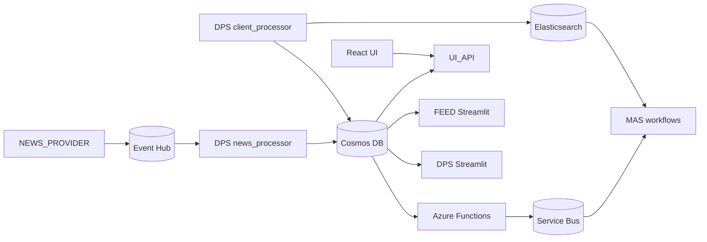

# SMIF

SMIF is an event-driven market insight system for ingesting news, enriching and storing it, matching it against client portfolios, and generating client-facing insights.

## Current Project Status

The repository is in a transition phase:

- The core pipeline is active: news ingestion, normalization, storage, queue dispatch, client portfolio processing, and MAS workflows.
- A new React UI and `UI_API` backend have been added for the operator dashboard and client views.
- The older Streamlit apps still exist and still run in Docker while the React UI reaches parity.

In practice, the repo currently supports both:

- React frontend at `src/ui`
- FastAPI UI backend at `src/app/modules/UI_API`
- Legacy Streamlit surfaces in `DPS` and `FEED`

## Runtime Architecture



## Main Services

### Application services

- `news_provider`: FastAPI service that polls Benzinga and publishes raw events to Event Hub.
- `dps_news_processor`: consumes Event Hub events, transforms them, and stores normalized news in Cosmos DB.
- `functions`: Azure Functions host for Cosmos DB change-feed dispatch and scheduled standard jobs.
- `mas`: consumes Service Bus queues and runs the `hnw`, `standard`, and `generate_insight` workflows.
- `dps_client_processor`: ingests client portfolio CSV data, writes portfolio documents to Cosmos DB, and updates Elasticsearch.
- `ui-api`: FastAPI backend for React-based ops and client views.
- `ui`: Vite/React frontend served through nginx and proxied to `ui-api`.
- `dps`: legacy Streamlit operations dashboard.
- `insight_feed_service`: legacy Streamlit client insight browser.

### Local infrastructure

- Azurite
- Cosmos DB Emulator
- Event Hub Emulator
- Service Bus Emulator
- SQL Server for the Service Bus emulator
- Elasticsearch

## End-to-End Flow

1. `NEWS_PROVIDER` receives Benzinga news and publishes events to Event Hub.
2. `dps_news_processor` normalizes those events and stores news documents in Cosmos DB.
3. `change_feed_service` publishes realtime workflow messages to Service Bus when new news documents appear.
4. `standard_trigger` publishes delayed standard-workflow jobs using scheduled enqueue time.
5. `mas` consumes:
   - `realtime-news-events`
   - `delayed-news-events`
   - `generate-insight-events`
6. `dps_client_processor` builds client portfolio documents and search data.
7. `ui-api`, `dps`, and `insight_feed_service` read from Cosmos DB to expose ops and client views.

## Repository Layout

```text
src/
  docker-compose.yaml
  requirements.txt
  ui/
  app/
    common/
    functions/
    modules/
      DPS/
      FEED/
      MAS/
      NEWS_PROVIDER/
      UI_API/
docs/
  react-ui-migration.md
  smif-current-phase.drawio
README.md
```

## Configuration

Most Python services load environment variables from `src/.env`.

Docker Compose uses `src/.env.docker`.

If you run Azure Functions outside Docker, use [src/app/functions/local.settings.json.example](/home/harshathvenkastesh/Desktop/SMIF/src/app/functions/local.settings.json.example) as the template for `local.settings.json`.

Important variables used across the current codebase:

- Cosmos DB: `COSMOS_URL`, `COSMOS_KEY`, `COSMOS_DB`
- Cosmos containers: `NEWS_CONTAINER`, `CLIENT_PORTFOLIO_CONTAINER`, `INSIGHTS_CONTAINER`
- Event Hub: `EVENTHUB_CONNECTION_STRING`, `EVENTHUB_NAME`
- Storage: `AZURE_STORAGE_ACCOUNT`, `AZURE_STORAGE_KEY`, `AZURE_STORAGE_CONNECTION_STRING`
- Service Bus: `SERVICEBUS_CONNECTION_STRING`, `QUEUE_REALTIME_NEWS`, `QUEUE_DELAYED_NEWS`, `QUEUE_GENERATE_INSIGHT`
- Azure Functions scheduling: `STANDARD_TRIGGER_SCHEDULE`, `STANDARD_TRIGGER_DELAY_MINUTES`
- UI API: `UI_API_PORT`, `UI_CORS_ORIGINS`
- LLM integrations: `LLM_BASE_URL` or `GROQ_BASE_URL`, `LLM_API_KEY` or `GROQ_API_KEY`, `GOOGLE_API_KEY`
- Search: `ELASTICSEARCH_URL`
- Source integration: `BENZINGA_API_KEY`

## Running Locally

From `src/`:

```bash
docker compose up --build
```

Primary local endpoints:

- React UI: `http://localhost:5173`
- UI API: `http://localhost:8088/api/health`
- DPS Streamlit dashboard: `http://localhost:8501`
- FEED Streamlit UI: `http://localhost:8502`
- Azure Functions host: `http://localhost:7071`
- News provider health: `http://localhost:8080/health`
- Elasticsearch: `http://localhost:9200`
- Cosmos DB Emulator explorer: `https://localhost:8081/_explorer/index.html`

## Frontend Migration Notes

The React migration is partially complete.

- `UI_API` already exposes read endpoints for clients, portfolios, insights, ops metrics, recent news, and recent insights.
- `UI_API` also exposes manual pipeline endpoints for file upload and sample runs.
- `src/ui` already provides `/ops` and `/clients` routes.
- Streamlit remains in place while missing interactions and views are ported.

See [docs/react-ui-migration.md](/home/harshathvenkastesh/Desktop/SMIF/docs/react-ui-migration.md) for the current migration checklist.

## Current Gaps / Assumptions

- The sample pipeline endpoint in `UI_API` is defensive and reports disabled status if `src/app/modules/DPS/news_raw` is not present.
- The legacy Streamlit services are still part of the default Docker runtime.
- The project expects a real `.env` file at `src/.env`; code in `app/common/azure_services/settings.py` raises immediately if that file is missing.

## Useful Entry Points

- [src/app/modules/NEWS_PROVIDER/main.py](/home/harshathvenkastesh/Desktop/SMIF/src/app/modules/NEWS_PROVIDER/main.py)
- [src/app/modules/DPS/services/news_processor/service.py](/home/harshathvenkastesh/Desktop/SMIF/src/app/modules/DPS/services/news_processor/service.py)
- [src/app/modules/DPS/services/client_processor/service.py](/home/harshathvenkastesh/Desktop/SMIF/src/app/modules/DPS/services/client_processor/service.py)
- [src/app/functions/change_feed_service/__init__.py](/home/harshathvenkastesh/Desktop/SMIF/src/app/functions/change_feed_service/__init__.py)
- [src/app/functions/standard_trigger/__init__.py](/home/harshathvenkastesh/Desktop/SMIF/src/app/functions/standard_trigger/__init__.py)
- [src/app/modules/MAS/__main__.py](/home/harshathvenkastesh/Desktop/SMIF/src/app/modules/MAS/__main__.py)
- [src/app/modules/UI_API/main.py](/home/harshathvenkastesh/Desktop/SMIF/src/app/modules/UI_API/main.py)
- [src/ui/src/App.tsx](/home/harshathvenkastesh/Desktop/SMIF/src/ui/src/App.tsx)
