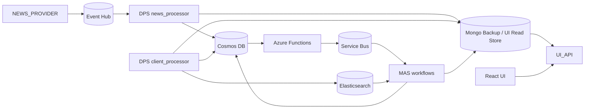

# SMIF

SMIF is an event-driven market insight system for ingesting news, enriching and storing it, matching it against client portfolios, and generating client-facing insights.

## Documentation Hub

Detailed runtime, service, workflow, and contract docs now live under [docs/README.md](/home/harshathvenkastesh/Desktop/SMIF/docs/README.md).

Recommended starting points:

- [docs/docker-runtime/README.md](/home/harshathvenkastesh/Desktop/SMIF/docs/docker-runtime/README.md)
- [docs/storage-and-contracts/README.md](/home/harshathvenkastesh/Desktop/SMIF/docs/storage-and-contracts/README.md)
- [docs/workflows/news-to-insight/README.md](/home/harshathvenkastesh/Desktop/SMIF/docs/workflows/news-to-insight/README.md)
- [docs/workflows/portfolio-and-relevance/README.md](/home/harshathvenkastesh/Desktop/SMIF/docs/workflows/portfolio-and-relevance/README.md)

## Current Project Status

The repository is in an active v1.2 state:

- The core pipeline is active: news ingestion, normalization, storage, queue dispatch, client portfolio processing, and MAS workflows.
- The supported UI stack is the React frontend in `src/ui` backed by the FastAPI `UI_API` service.
- The deprecated Streamlit interfaces have been removed from the default runtime and are no longer part of local Docker Compose.
- MAS relevance admission is currently tuned for lower false-positive volume before `generate_insight` runs:
  - Standard workflow threshold: `0.75`
  - Standard final candidate cap: `10`
  - HNW workflow threshold: `0.85`
  - HNW final candidate cap: `5`

In practice, the repo currently supports both:

- React frontend at `src/ui`
- FastAPI UI backend at `src/app/modules/UI_API`
- Event-driven backend services in `NEWS_PROVIDER`, `DPS`, `MAS`, and Azure Functions

## Runtime Architecture



## Main Services

### Application services

- `news_provider`: FastAPI service that polls Benzinga and publishes raw events to Event Hub.
- `dps_news_processor`: consumes Event Hub events, transforms them, and stores normalized news in Cosmos DB.
- `functions`: Azure Functions host for Cosmos DB change-feed dispatch and scheduled standard jobs.
- `mas`: consumes Service Bus queues and runs the `hnw`, `standard`, and `generate_insight` workflows.
- `dps_client_processor`: ingests client portfolio CSV data, writes portfolio documents to Cosmos DB, mirrors them to Mongo when enabled, and updates Elasticsearch.
- `ui-api`: FastAPI backend for React-based ops and client views; the current implementation reads Mongo-backed collections.
- `ui`: Vite/React frontend served through nginx and proxied to `ui-api`.

### Local infrastructure

- Azurite
- Cosmos DB Emulator
- Event Hub Emulator
- Service Bus Emulator
- SQL Server for the Service Bus emulator
- Elasticsearch

## End-to-End Flow

1. `NEWS_PROVIDER` receives Benzinga news and publishes events to Event Hub.
2. `dps_news_processor` normalizes those events and stores news documents in Cosmos DB.
3. `change_feed_service` publishes realtime workflow messages to Service Bus when new news documents appear.
4. `standard_trigger` publishes delayed standard-workflow jobs using scheduled enqueue time.
5. `mas` consumes:
   - `realtime-news-events`
   - `delayed-news-events`
   - `generate-insight-events`
6. `dps_client_processor` builds client portfolio documents and search data.
7. `ui-api` reads Mongo-backed collections to expose ops and client views to the React frontend.

## Repository Layout

```text
src/
  docker-compose.yaml
  requirements.txt
  ui/
  app/
    common/
    functions/
    modules/
      DPS/
      MAS/
      NEWS_PROVIDER/
      UI_API/
docs/
  README.md
  docker-runtime/
  docker-services/
  workflows/
  storage-and-contracts/
  token-analysis.md
  react-ui-migration.md
  smif-current-phase.drawio
SMIF-v1.2-REVISIONS.md
README.md
```

## Current MAS Relevance Defaults

- Standard workflow uses `min_score=0.75` and `final_top_n=10`.
- HNW workflow uses `min_score=0.85` and `final_top_n=5`.
- These values are wired through `src/app/modules/MAS/workflow/standard.py`, `src/app/modules/MAS/workflow/hnw.py`, and `src/app/modules/MAS/config/settings.py`.

## Configuration

Most Python services load environment variables from `src/.env`.

Docker Compose uses `src/.env.docker`.

When `MONGO_BACKUP_ENABLED=true`, Docker startup restores Mongo backup data into the Cosmos emulator through the one-shot `backup_copy` service before Cosmos-dependent services are started.

If you run Azure Functions outside Docker, use [src/app/functions/local.settings.json.example](/home/harshathvenkastesh/Desktop/SMIF/src/app/functions/local.settings.json.example) as the template for `local.settings.json`.

Important variables used across the current codebase:

- Cosmos DB: `COSMOS_URL`, `COSMOS_KEY`, `COSMOS_DB`
- Cosmos containers: `NEWS_CONTAINER`, `CLIENT_PORTFOLIO_CONTAINER`, `INSIGHTS_CONTAINER`
- Event Hub: `EVENTHUB_CONNECTION_STRING`, `EVENTHUB_NAME`
- Storage: `AZURE_STORAGE_ACCOUNT`, `AZURE_STORAGE_KEY`, `AZURE_STORAGE_CONNECTION_STRING`
- Service Bus: `SERVICEBUS_CONNECTION_STRING`, `QUEUE_REALTIME_NEWS`, `QUEUE_DELAYED_NEWS`, `QUEUE_GENERATE_INSIGHT`
- Azure Functions scheduling: `STANDARD_TRIGGER_SCHEDULE`, `STANDARD_TRIGGER_DELAY_MINUTES`
- UI API: `UI_API_PORT`, `UI_CORS_ORIGINS`
- LLM integrations: `LLM_BASE_URL` or `GROQ_BASE_URL`, `LLM_API_KEY` or `GROQ_API_KEY`, `GOOGLE_API_KEY`
- Search: `ELASTICSEARCH_URL`
- Source integration: `BENZINGA_API_KEY`

## Running Locally

From `src/`:

```bash
docker compose up --build
```

Startup order for Cosmos-backed services is:

- `cosmos-emulator`
- `backup_copy`
- application services such as `functions`, `mas`, `ui-api`, `dps_news_processor`, and `dps_client_processor`

Primary local endpoints:

- React UI: `http://localhost:5173`
- UI API: `http://localhost:8088/api/health`
- Azure Functions host: `http://localhost:7071`
- News provider health: `http://localhost:8080/health`
- Elasticsearch: `http://localhost:9200`
- Cosmos DB Emulator explorer: `https://localhost:8081/_explorer/index.html`

## Frontend Migration Notes

The React UI is the supported frontend.

- `UI_API` already exposes read endpoints for clients, portfolios, insights, ops metrics, recent news, and recent insights.
- The active `UI_API` app is currently read-focused; older pipeline helper code remains in the repo but is commented out in the live FastAPI surface.
- `src/ui` already provides `/ops` and `/clients` routes.
- Older migration notes remain in the repo for historical context, but the Streamlit runtime path has been retired.

See [docs/react-ui-migration.md](/home/harshathvenkastesh/Desktop/SMIF/docs/react-ui-migration.md) for the current migration checklist.

## Current Gaps / Assumptions

- `UI_API` is Mongo-backed in the current implementation, so live UI correctness depends on Mongo being available and current.
- The sample pipeline helper code in `UI_API` is present but not mounted as active routes.
- The project expects a real `.env` file at `src/.env`; code in `app/common/azure_services/settings.py` raises immediately if that file is missing.

## Useful Entry Points

- [src/app/modules/NEWS_PROVIDER/main.py](/home/harshathvenkastesh/Desktop/SMIF/src/app/modules/NEWS_PROVIDER/main.py)
- [src/app/modules/DPS/services/news_processor/service.py](/home/harshathvenkastesh/Desktop/SMIF/src/app/modules/DPS/services/news_processor/service.py)
- [src/app/modules/DPS/services/client_processor/service.py](/home/harshathvenkastesh/Desktop/SMIF/src/app/modules/DPS/services/client_processor/service.py)
- [src/app/functions/change_feed_service/__init__.py](/home/harshathvenkastesh/Desktop/SMIF/src/app/functions/change_feed_service/__init__.py)
- [src/app/functions/standard_trigger/__init__.py](/home/harshathvenkastesh/Desktop/SMIF/src/app/functions/standard_trigger/__init__.py)
- [src/app/modules/MAS/__main__.py](/home/harshathvenkastesh/Desktop/SMIF/src/app/modules/MAS/__main__.py)
- [src/app/modules/UI_API/main.py](/home/harshathvenkastesh/Desktop/SMIF/src/app/modules/UI_API/main.py)
- [src/ui/src/App.tsx](/home/harshathvenkastesh/Desktop/SMIF/src/ui/src/App.tsx)
