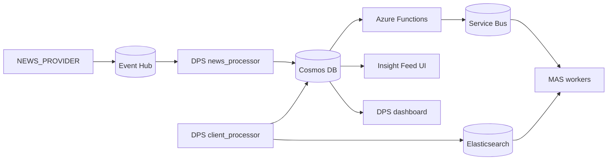

# SMIF

SMIF is an event-driven market insight pipeline that ingests realtime news, normalizes and stores it, matches it against client portfolios, and generates client-facing insights.

## Current State

The repository currently runs as five application areas plus local infrastructure:

- `NEWS_PROVIDER` streams Benzinga realtime news into Event Hub.
- `DPS` provides the operator dashboard and the data-processing services for news and client portfolios.
- `functions` hosts the Azure Functions app for Cosmos DB change-feed dispatch and scheduled standard jobs.
- `MAS` runs the workflow workers that evaluate relevance and generate insight jobs.
- `FEED` provides a Streamlit UI for browsing clients, portfolios, and saved insights.

Notable changes reflected in the current codebase:

- MAS no longer contains the old Streamlit UI; client-facing browsing moved to `src/app/modules/FEED`.
- DPS is split across a dashboard plus dedicated `news_processor` and `client_processor` services.
- The standard workflow is scheduled by the Azure Functions `standard_trigger` timer and published to `delayed-news-events`.
- Shared emulator config now lives under `src/app/common`.

## Architecture



Event flow:

1. `NEWS_PROVIDER` listens to the Benzinga websocket feed and publishes raw events to Event Hub.
2. `dps_news_processor` consumes Event Hub, normalizes news, and writes news documents into Cosmos DB.
3. `change_feed_service` reacts to Cosmos DB news inserts and publishes `realtime_news` messages to Service Bus.
4. `standard_trigger` publishes delayed `standard_news` jobs to `QUEUE_DELAYED_NEWS` using scheduled enqueue time.
5. `MAS` consumes `realtime-news-events`, `delayed-news-events`, and `generate-insight-events`.
6. `dps_client_processor` builds client portfolio documents and indexes them into Cosmos DB and Elasticsearch.
7. `FEED` reads client portfolios and saved insights from Cosmos DB.

## Repository Layout

```text
src/
  docker-compose.yaml
  requirements.txt
  app/
    common/
      settings.py
      azure_services/
        cosmos.py
        eventhub-config.json
        eventhub.py
        service_bus.py
        servicebus-config.json
        settings.py
    functions/
      change_feed_service/
      standard_trigger/
      host.json
      local.settings.json.example
      start.sh
    modules/
      DPS/
      FEED/
      MAS/
      NEWS_PROVIDER/
docs/
  smif-current-phase.drawio
README.md
```

## Services

### Application services

- `dps`: Streamlit operations dashboard on port `8501`, plus the DPS background listener process.
- `dps_news_processor`: consumes Event Hub news and writes normalized documents into Cosmos DB.
- `dps_client_processor`: processes `portfolio.csv`, writes client portfolio documents, and updates search storage.
- `functions`: Azure Functions host on port `7071`.
- `mas`: background workers for `hnw`, `standard`, and `generate_insight` workflows.
- `news_provider`: FastAPI service on port `8080` with `/health`, `/ready`, and `/stats`.
- `insight_feed_service`: Streamlit client insight UI on port `8502`.

### Local infrastructure

- Azurite on ports `10000` to `10002`
- Cosmos DB Emulator on port `8081`
- Event Hub Emulator on port `5672`
- Service Bus Emulator on ports `5672` and `5300`
- SQL Server for the Service Bus emulator
- Elasticsearch on port `9200`

## Configuration

The code expects a project-level env file at `src/.env`.

Docker Compose expects `src/.env.docker`.

Azure Functions local host settings are documented in [src/app/functions/local.settings.json.example](/home/harshathvenkastesh/Desktop/SMIF/src/app/functions/local.settings.json.example).

Important variables used across services:

- Cosmos DB: `COSMOS_URL`, `COSMOS_KEY`, `COSMOS_DB`
- Containers: `NEWS_CONTAINER`, `CLIENT_PORTFOLIO_CONTAINER`, `INSIGHTS_CONTAINER`
- Event Hub: `EVENTHUB_CONNECTION_STRING`, `EVENTHUB_NAME`
- Service Bus: `SERVICEBUS_CONNECTION_STRING`, `QUEUE_REALTIME_NEWS`, `QUEUE_DELAYED_NEWS`, `QUEUE_GENERATE_INSIGHT`
- Workflow control: `STANDARD_TRIGGER_SCHEDULE`, `STANDARD_TRIGGER_DELAY_MINUTES`
- LLM and source integrations: `GROQ_BASE_URL`, `GROQ_API_KEY`, `BENZINGA_API_KEY`
- Storage: `AZURE_STORAGE_ACCOUNT`, `AZURE_STORAGE_KEY`, `AZURE_STORAGE_CONNECTION_STRING`

## Running Locally

From `src/`:

```bash
docker compose up --build
```

Useful endpoints after startup:

- DPS dashboard: `http://localhost:8501`
- Insight feed UI: `http://localhost:8502`
- Azure Functions host: `http://localhost:7071`
- News provider health: `http://localhost:8080/health`
- Elasticsearch: `http://localhost:9200`
- Cosmos DB Emulator explorer: `https://localhost:8081/_explorer/index.html`

## Module Entry Points

Relevant runtime entry points in the current project:

- [src/app/modules/NEWS_PROVIDER/main.py](/home/harshathvenkastesh/Desktop/SMIF/src/app/modules/NEWS_PROVIDER/main.py)
- [src/app/modules/DPS/streamlit_app.py](/home/harshathvenkastesh/Desktop/SMIF/src/app/modules/DPS/streamlit_app.py)
- [src/app/modules/DPS/services/news_processor/service.py](/home/harshathvenkastesh/Desktop/SMIF/src/app/modules/DPS/services/news_processor/service.py)
- [src/app/modules/DPS/services/client_processor/service.py](/home/harshathvenkastesh/Desktop/SMIF/src/app/modules/DPS/services/client_processor/service.py)
- [src/app/functions/change_feed_service/__init__.py](/home/harshathvenkastesh/Desktop/SMIF/src/app/functions/change_feed_service/__init__.py)
- [src/app/functions/standard_trigger/__init__.py](/home/harshathvenkastesh/Desktop/SMIF/src/app/functions/standard_trigger/__init__.py)
- [src/app/modules/MAS/__main__.py](/home/harshathvenkastesh/Desktop/SMIF/src/app/modules/MAS/__main__.py)
- [src/app/modules/MAS/workflow/hnw.py](/home/harshathvenkastesh/Desktop/SMIF/src/app/modules/MAS/workflow/hnw.py)
- [src/app/modules/MAS/workflow/standard.py](/home/harshathvenkastesh/Desktop/SMIF/src/app/modules/MAS/workflow/standard.py)
- [src/app/modules/MAS/workflow/generate_insight.py](/home/harshathvenkastesh/Desktop/SMIF/src/app/modules/MAS/workflow/generate_insight.py)
- [src/app/modules/FEED/main.py](/home/harshathvenkastesh/Desktop/SMIF/src/app/modules/FEED/main.py)

## Notes

- The worktree is currently dirty in multiple runtime modules; the README was updated to describe the checked-out codebase as it exists now.
- `src/app/common/settings.py` currently prints the resolved `.env` path during import; that is behavior in the code, not a README artifact.
