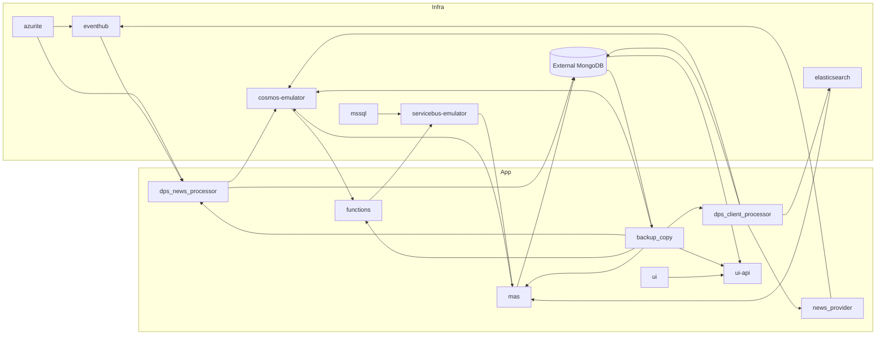

# Docker Runtime

This document describes the runtime boundaries defined by [src/docker-compose.yaml](../../src/docker-compose.yaml).

## Topology

## Service Matrix

| Service | Kind | Runtime Shape | Main Responsibility |
| --- | --- | --- | --- |
| `azurite` | infra | long-running | local blob/queue/table emulator; active path is blob storage for Event Hub checkpoints and emulator backing |
| `cosmos-emulator` | infra | long-running | primary operational store for news, client profiles, holdings snapshots, insights, and function leases |
| `backup_copy` | app | one-shot | restore Mongo backup data into Cosmos before Cosmos-dependent services continue |
| `eventhub` | infra | long-running | ingest bus between `news_provider` and `dps_news_processor` |
| `servicebus-emulator` | infra | long-running | queue bus between `functions` and `mas` |
| `mssql` | infra | long-running | metadata store required by `servicebus-emulator` |
| `elasticsearch` | infra | long-running | client relevance retrieval index used by `mas` |
| `mas` | app | long-running | consume Service Bus queues and run `hnw`, `standard`, and `generate_insight` workflows |
| `ui-api` | app | long-running | FastAPI read API for the React UI; reads Mongo-backed collections |
| `ui` | app | long-running | static Vite build served by nginx and proxied to `ui-api` |
| `functions` | app | long-running | Azure Functions host for Cosmos change feed dispatch and scheduled standard jobs |
| `news_provider` | app | long-running | poll Benzinga and publish raw news payloads to Event Hub |
| `dps_news_processor` | app | long-running | consume Event Hub news, normalize it, and store it in Cosmos |
| `dps_client_processor` | app | one-shot | build portfolio/search representations from CSV and preload Cosmos plus Elasticsearch |

## Startup Logic

### One-shot initializers

- `backup_copy` runs first for Cosmos hydration.
- `dps_client_processor` runs after `backup_copy` and is expected to complete successfully.
- `news_provider` is intentionally gated on `dps_client_processor` completion so ingestion does not start before client search context exists.

### Long-running graph

- `news_provider` publishes into `eventhub`.
- `dps_news_processor` consumes from `eventhub` and writes normalized news documents into `cosmos-emulator`.
- `functions` watches Cosmos change feed and publishes scheduled or realtime queue messages into `servicebus-emulator`.
- `mas` consumes three queues from `servicebus-emulator`, reads Cosmos and Elasticsearch, then writes insights and monitoring updates.
- `ui-api` serves the React frontend by reading Mongo collections.
- `ui` proxies browser `/api/*` calls to `ui-api`.

## State And Persistence

| Service | Persistent State |
| --- | --- |
| `azurite` | `azurite_data` volume |
| `cosmos-emulator` | `cosmos` volume |
| `elasticsearch` | `esdata` volume |
| `eventhub` | config bind mount plus Azurite backing storage |
| `servicebus-emulator` | config bind mount plus `mssql` state |
| `backup_copy` | none; transient restore job |
| `dps_client_processor` | none locally; writes to Cosmos, Mongo, Elasticsearch |
| `news_provider` | in-memory polling cursor only |
| `dps_news_processor` | Event Hub checkpoints in Azurite blob storage |
| `functions` | Cosmos leases container plus queue side effects |
| `mas` | queue side effects, Cosmos writes, Mongo mirror writes, insight log files inside the container filesystem |
| `ui-api` | no local state; query service |
| `ui` | static build baked into image |

## Runtime Notes

- Most Python containers mount `./.env.docker` to `/app/.env` and also load it through `env_file`.
- `functions` is the exception: it is hosted from `/home/site/wwwroot` and primarily uses environment variables rather than the shared Pydantic settings object.
- `ui-api` is not a Cosmos reader in the current implementation. It uses `MONGO_URI` and `MONGO_DB` from [src/app/modules/UI_API/main.py](../../src/app/modules/UI_API/main.py).
- `eventhub-config.json` defines both `news-stream` and `news-processed`, but the active Compose path is driven by `EVENTHUB_NAME`; current ingestion code uses the hub named in env rather than both entities simultaneously.
