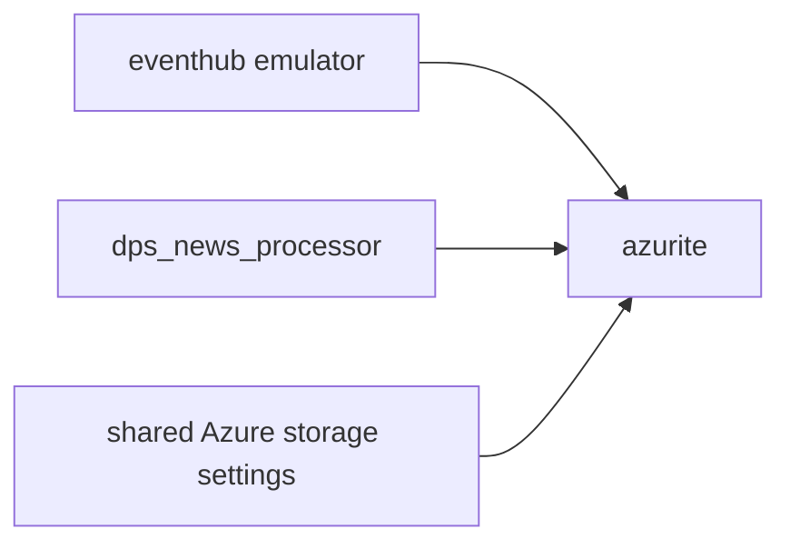

# azurite

`azurite` is the local Azure Storage emulator in the Compose stack.

## Runtime Contract

- Compose service: `azurite`
- Image: `mcr.microsoft.com/azure-storage/azurite:latest`
- Host ports:
  - `10000` blob
  - `10001` queue
  - `10002` table
- Persistent state: `azurite_data` volume
- Healthcheck: TCP connect on port `10000`

## What Uses It

In the current runtime, the important paths are:

- Event Hub emulator backing storage
- Event Hub checkpoint blob container used by `dps_news_processor`

The queue and table endpoints are exposed, but the active code path is centered on blob storage.

## Configuration Notes

- The container is started with explicit emulator accounts through `AZURITE_ACCOUNTS`.
- `--skipApiVersionCheck` is enabled to reduce local client friction.
- Data is written under `/data` inside the container and persisted in the `azurite_data` Docker volume.

## Operational Role

Azurite is not business-logic aware. Its role is to keep two other systems viable:

1. `eventhub` relies on it for emulator metadata and blob dependencies.
2. `dps_news_processor` relies on it for Event Hub checkpoint storage, which prevents full-stream replay on every restart.

## Failure Impact

If `azurite` is unavailable:

- Event Hub emulator startup becomes unreliable.
- `dps_news_processor` may fail to create or read its checkpoint container.
- Event consumption can fall back toward replay behavior because checkpoint persistence is lost.
