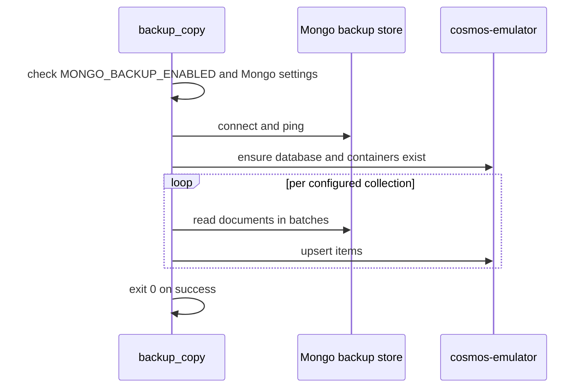

# backup_copy

`backup_copy` is a one-shot startup initializer that restores backup data from Mongo into Cosmos.

## Runtime Contract

- Compose service: `backup_copy`
- Build file:
  - [src/app/modules/BACKUP_COPY/.dockerfile](../../../src/app/modules/BACKUP_COPY/.dockerfile)
- Entrypoint:
  - `python -m app.modules.BACKUP_COPY`
- Depends on:
  - `cosmos-emulator` healthy
- Restart policy:
  - `"no"`

## Logic Flow

## What It Restores

The current implementation restores three configured containers:

- news
- client portfolio
- insights

It does not restore the holdings snapshot container. Holdings snapshots are regenerated by `dps_client_processor`.

## Why It Exists

The local stack treats Cosmos as the operational store for pipeline services, but startup data can originate from Mongo:

- older persisted news
- client profiles
- stored insights

That lets downstream services boot against a warmed Cosmos dataset instead of an empty emulator.

## Important Behavior

- If backup settings are not enabled, the service logs `backup_copy_disabled` and exits successfully.
- Container creation is dynamic through the shared Cosmos helper.
- Mongo documents have `_id` removed before Cosmos upsert so the Cosmos `id` field remains the document identifier.

## Downstream Dependents

`backup_copy` gates:

- `dps_client_processor`
- `dps_news_processor`
- `functions`
- `mas`
- `ui-api`

That makes it the first app-owned barrier in the Compose startup sequence.
