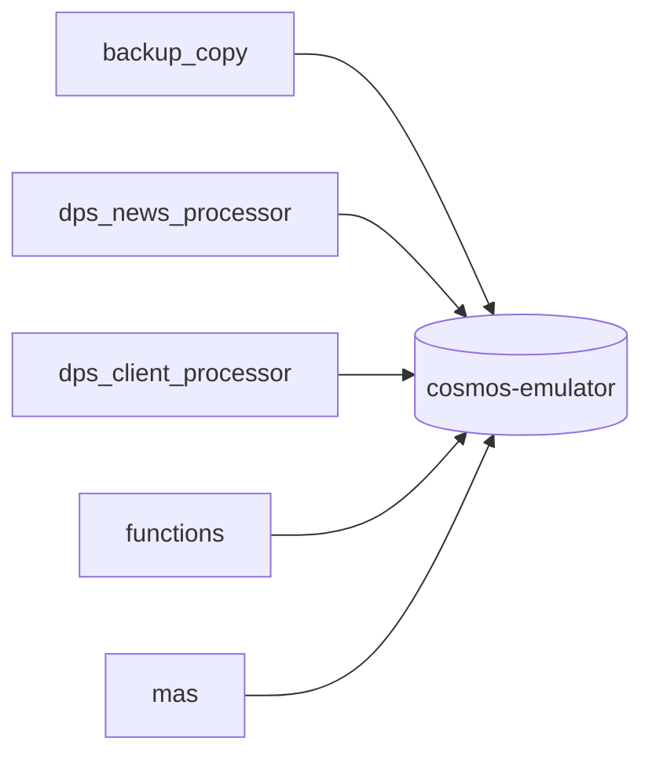
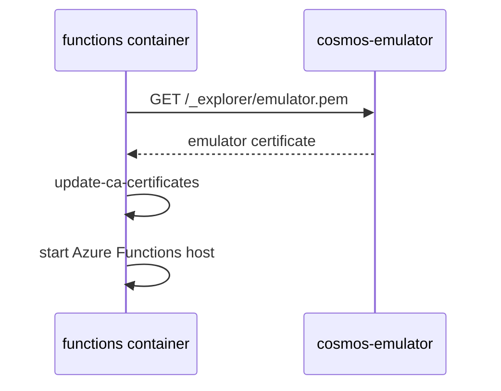

# cosmos-emulator

`cosmos-emulator` is the primary operational datastore in the local stack.

## Runtime Contract

- Compose service: `cosmos-emulator`
- Image: `mcr.microsoft.com/cosmosdb/linux/azure-cosmos-emulator:latest`
- Host ports:
  - `8081` HTTPS gateway and explorer
  - `10251` to `10254` internal emulator ports
- Network aliases:
  - `cosmos`
  - `cosmos-emulator.DOMAIN`
- Persistent state: `cosmos` Docker volume
- Healthcheck: `curl -k https://localhost:8081/_explorer/index.html`

## What Uses It

`ui-api` does not currently read Cosmos directly. Its read path is Mongo-backed.

## Containers In Active Use

The exact names come from environment variables, but the current logic expects these classes of containers:

- news container
- client portfolio container
- insights container
- holdings snapshot container derived from the client portfolio container name
- change-feed lease container created by Azure Functions

## Service-Level Responsibilities Around Cosmos

### `backup_copy`

- creates the configured databases and containers if missing
- restores news, client portfolio, and insights documents from Mongo into Cosmos

### `dps_news_processor`

- upserts normalized news documents
- initializes monitoring stages such as `dps_news_processor` and `retail_batch`

### `dps_client_processor`

- upserts search profile documents into the client portfolio container
- upserts holdings snapshot documents into the derived holdings container

### `functions`

- Cosmos DB trigger watches the news container
- Azure Functions lease state is kept in Cosmos

### `mas`

- reads news, client profiles, and holdings snapshots
- writes monitoring updates back onto news documents
- writes insight documents into the insights container

## Certificate Handling

The `functions` container explicitly downloads the Cosmos emulator certificate from `https://cosmos-emulator.DOMAIN:8081/_explorer/emulator.pem` before starting the host.

## Failure Impact

If `cosmos-emulator` is unavailable:

- `backup_copy` cannot hydrate startup data
- `dps_news_processor` cannot persist normalized news
- `functions` change feed cannot dispatch realtime jobs
- `mas` cannot read grounding context or persist results
