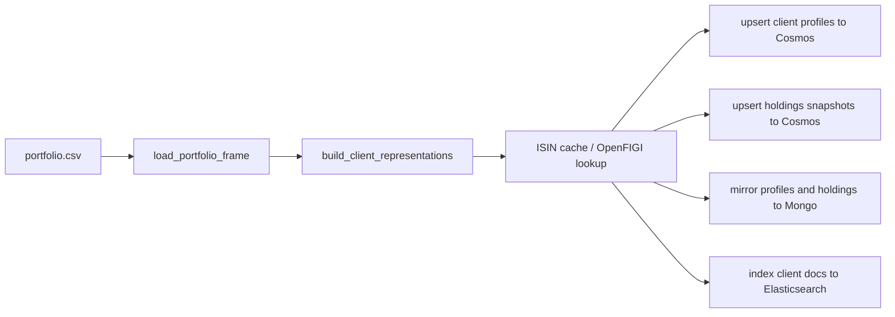

# dps_client_processor

`dps_client_processor` is a one-shot portfolio loader that builds the client retrieval and grounding corpus.

## Runtime Contract

- Compose service: `dps_client_processor`
- Build file:
  - [src/app/modules/DPS/services/client_processor/.dockerfile](../../../src/app/modules/DPS/services/client_processor/.dockerfile)
- Entrypoint:
  - `python -m app.modules.DPS.services.client_processor`
- Depends on:
  - `backup_copy`
- Input bind mount:
  - `./app/modules/DPS/services/client_processor/portfolio.csv`

## Logic Flow

## What It Produces

### Search profile documents

Used by MAS retrieval. These documents include:

- client segment and mandate context
- classification and asset-type weights
- major tickers and issuers
- summary text for lexical and embedding retrieval

### Holdings snapshot documents

Used by MAS grounding. These documents include canonicalized holdings fields such as:

- ISIN
- ticker
- underlying ticker
- classification
- currency
- portfolio weight
- issuer metadata

## Key Business Rules

- HNW segmentation is driven by `HNW_SEGMENT_MIN_AUM_AED`.
- ISIN mapping uses a local cache first, then batches misses through OpenFIGI.
- Elasticsearch indexing adds a `dense_vector` embedding to each client profile document.

## Why It Is A One-Shot Service

This service is expected to complete and exit. Compose uses that completion event as a gate:

- `news_provider` waits for it before starting

That ensures the system does not start ingesting live news before the client corpus is usable for relevance search and holdings grounding.

## Failure Impact

If this service fails:

- client profiles may be stale or missing in Cosmos
- holdings snapshots may be missing
- Elasticsearch may not contain the retrieval corpus
- `news_provider` does not start because its `depends_on` requires successful completion
