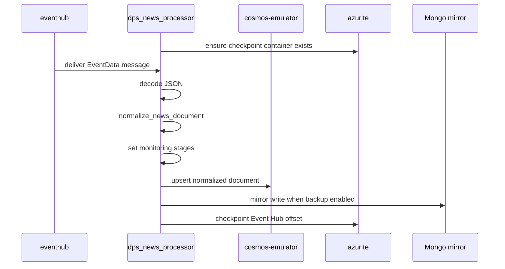

# dps_news_processor

`dps_news_processor` consumes Event Hub news, normalizes it, and stores it in Cosmos.

## Runtime Contract

- Compose service: `dps_news_processor`
- Build file:
  - [src/app/modules/DPS/services/news_processor/.dockerfile](../../../src/app/modules/DPS/services/news_processor/.dockerfile)
- Entrypoint:
  - `python -m app.modules.DPS.services.news_processor`
- Depends on:
  - `azurite`
  - `backup_copy`
  - `eventhub`

## Logic Flow

## Business Role

This service converts inbound news from transport shape into the canonical document shape used by the rest of the system.

Core responsibilities:

- normalize source fields like title, content, authors, symbols, tags, and timestamps
- preserve a stable `id`
- initialize monitoring state for later workflow stages
- persist the document into Cosmos

## Monitoring Stages Written Here

Every successful document is tagged with:

- `dps_news_processor=stored`
- `retail_batch=pending`

The second stage is what later makes the article eligible for scheduled standard workflow handling.

## Checkpointing

The service uses Event Hub consumer group `DPS` and stores checkpoints in Azurite-backed blob storage. That means successful Cosmos upsert is coupled to checkpoint advancement.

If normalization or upsert fails:

- the exception is logged
- the checkpoint is not advanced
- the message may be retried depending on consumer behavior
