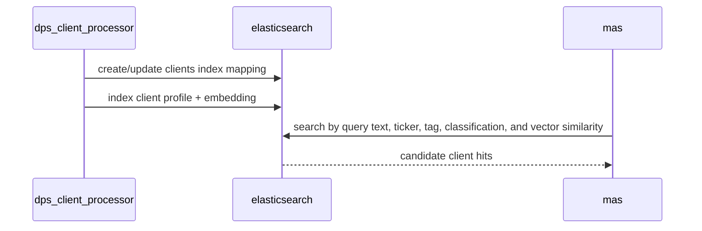

# elasticsearch

`elasticsearch` stores the client retrieval corpus used by MAS relevance search.

## Runtime Contract

- Compose service: `elasticsearch`
- Image: `docker.elastic.co/elasticsearch/elasticsearch:9.3.1`
- Host port: `9200`
- Persistent state: `esdata` Docker volume
- Mode:
  - `discovery.type=single-node`
  - security disabled for local development
- Healthcheck:
  - `curl http://localhost:9200/_cluster/health`

## What Uses It

## Index Role

The active index is `clients`.

It stores client profile documents enriched with:

- lexical fields for BM25-style search
- dense vector embeddings
- segment, mandate, ticker, classification, and issuer metadata

## Logic Flow

## Why MAS Needs It

MAS does not brute-force every client on every article. It first narrows the universe with Elasticsearch:

- deterministic filters and overlap signals
- lexical relevance
- embedding similarity against the client summary document

That keeps the later grounding and LLM steps focused on a smaller candidate set.

## Failure Impact

If `elasticsearch` is unavailable:

- `dps_client_processor` cannot create or refresh the retrieval index
- `mas` loses its main candidate-retrieval layer
- direct client-grounding logic still exists, but the normal workflow entry path becomes severely degraded
