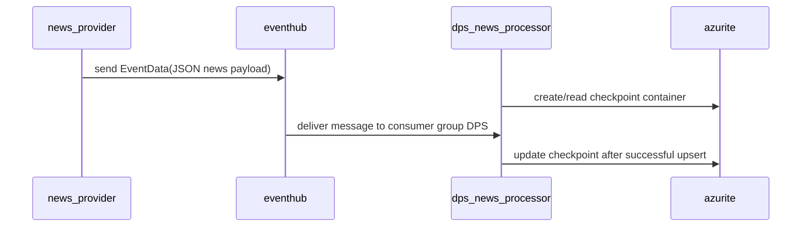

# eventhub

`eventhub` is the local Event Hubs emulator used for the ingestion leg of the pipeline.

## Runtime Contract

- Compose service: `eventhub`
- Image: `mcr.microsoft.com/azure-messaging/eventhubs-emulator:latest`
- Host ports:
  - `127.0.0.1:5672` AMQP
  - `127.0.0.1:9092` Kafka-compatible endpoint
- Config file:
  - [src/app/common/azure_services/eventhub-config.json](../../../src/app/common/azure_services/eventhub-config.json)
- Dependency:
  - `azurite` must be healthy first

## Configured Entities

The emulator config defines:

- namespace `emulatorns1`
- event hub `news-processed` with consumer group `MAS`
- event hub `news-stream` with consumer group `DPS`

## Active Compose Path

```mermaid
flowchart LR
    NP[news_provider] --> EH[eventhub]
    EH --> DPSN[dps_news_processor]
    AZ[azurite checkpoint store] <-- EH
```

The current active path is driven by `EVENTHUB_NAME` in environment settings:

- `news_provider` publishes raw news into that hub
- `dps_news_processor` consumes it using consumer group `DPS`

The configured `news-processed` hub and MAS Event Hub consumer code exist in the repo, but they are not on the primary Compose-driven flow today because MAS currently consumes Service Bus queues instead.

## Logic Flow



## Why It Exists Separately From Service Bus

Event Hub is used for streaming ingestion fan-in:

- high-frequency, append-style news delivery
- checkpoint-based consumer progress

Service Bus is used later for workflow orchestration:

- queue semantics
- scheduled delivery
- delivery counts and dead-letter handling

## Failure Impact

If `eventhub` is unavailable:

- `news_provider` can still poll Benzinga, but publish attempts fail
- `dps_news_processor` cannot receive the ingest stream
- no new news reaches Cosmos, so the rest of the pipeline stalls upstream
