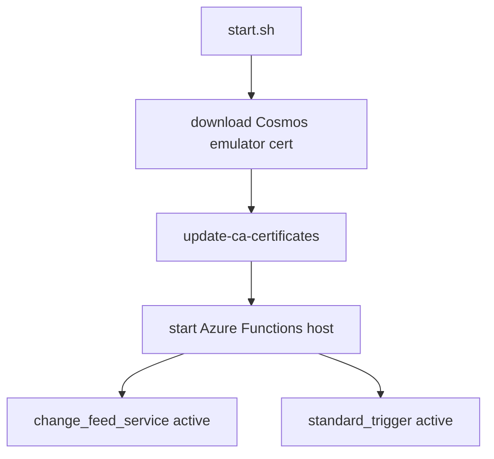
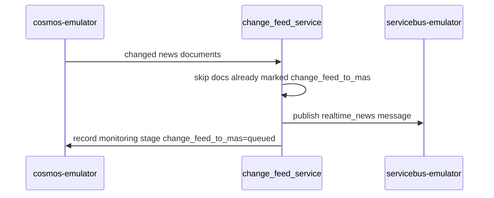
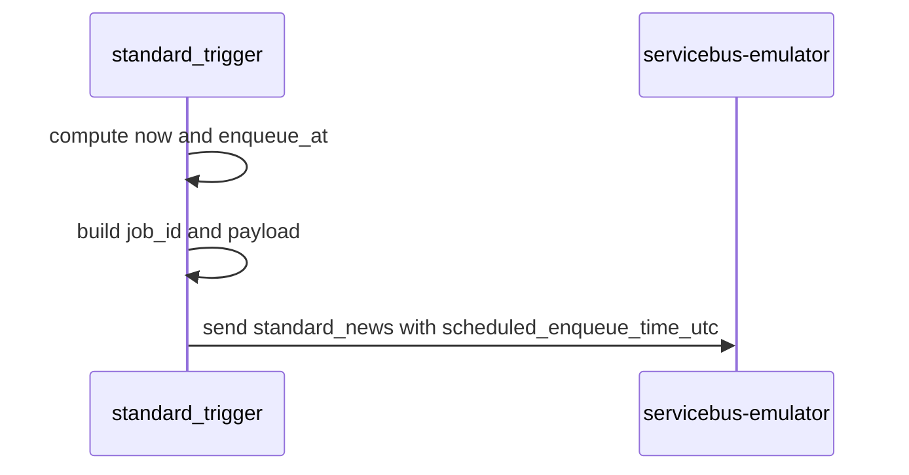

# functions

`functions` is the Azure Functions host that converts stored news into workflow queue activity.

## Runtime Contract

- Compose service: `functions`
- Build file:
  - [src/app/functions/.dockerfile](../../../src/app/functions/.dockerfile)
- HTTP port:
  - `7071`
- Depends on:
  - `azurite`
  - `backup_copy`
  - `servicebus-emulator`
- Startup wrapper:
  - [src/app/functions/start.sh](../../../src/app/functions/start.sh)

## Host Boot Flow

The certificate bootstrap is necessary because the Functions image connects to the Cosmos emulator over HTTPS.

## Function 1: `change_feed_service`

### Binding

- trigger type: `cosmosDBTrigger`
- source container: configured `NEWS_CONTAINER`
- lease container: configured `CHANGE_FEED_LEASE_CONTAINER`

### Logic

Key behaviors:

- extracts `id` from each changed document
- ignores documents already marked in `monitoring.stages.change_feed_to_mas`
- publishes to `QUEUE_REALTIME_NEWS`
- records a monitoring update back on the source news document

## Function 2: `standard_trigger`

### Binding

- trigger type: `timerTrigger`
- schedule source: `STANDARD_TRIGGER_SCHEDULE`

### Logic

Key behaviors:

- reads `STANDARD_TRIGGER_DELAY_MINUTES`
- validates delay is a non-negative integer
- publishes to `QUEUE_DELAYED_NEWS`
- uses Service Bus scheduled enqueue time instead of sleeping locally

## Why This Service Exists

It is the orchestration seam between data persistence and workflow execution:

- Cosmos change feed -> HNW path
- timer schedule -> retail batch path

The older DPS change-feed listener code still exists in the repo, but the Compose runtime uses Azure Functions as the active change-feed dispatcher.
