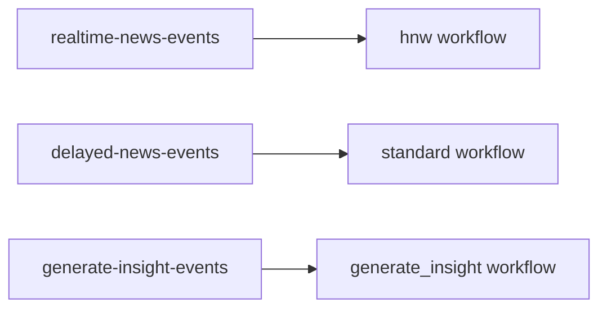
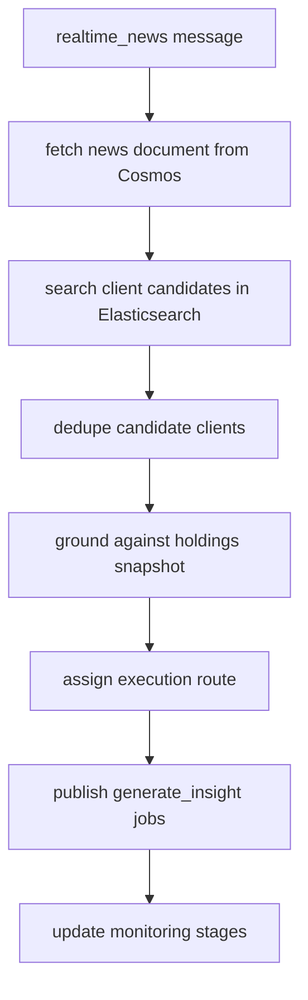
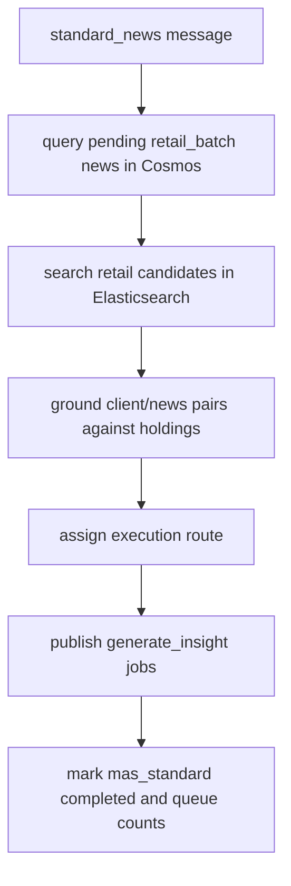
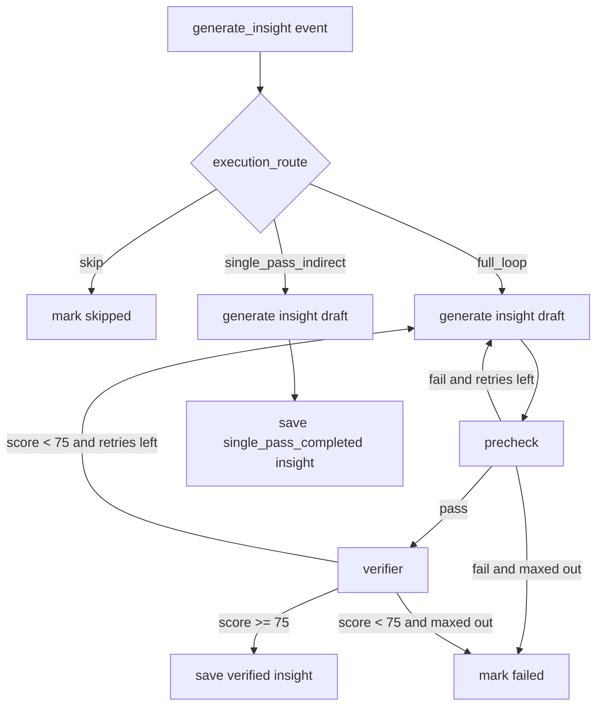

# mas

`mas` is the orchestration and insight-generation service. It contains three distinct workflows inside one long-running process.

## Runtime Contract

- Compose service: `mas`
- Build file:
  - [src/app/modules/MAS/.dockerfile](../../../src/app/modules/MAS/.dockerfile)
- Entrypoint:
  - `python -m app.modules.MAS`
- Depends on:
  - `azurite`
  - `backup_copy`
  - `servicebus-emulator`
- Runtime dependencies not explicitly health-gated in Compose:
  - `cosmos-emulator`
  - `elasticsearch`
  - LLM backend configured through env

## Queue To Workflow Map

## Message Handling Envelope

Before business logic runs, the service does message-level orchestration:

- receive one message at a time per worker semaphore
- decode JSON body
- validate the expected `event_type`
- run the mapped workflow
- `complete` on success
- `abandon` on failure below max delivery attempts
- `dead-letter` on failure at or above `SERVICEBUS_MAX_DELIVERY_ATTEMPTS`
- enable lock renewal for `generate_insight` messages

## HNW Workflow

Business intent:

- process newly arrived news quickly
- target the HNW client segment
- move only grounded candidates into generation

## Standard Workflow

Business intent:

- process a time-windowed batch instead of one article at a time
- drain news documents previously marked `retail_batch=pending`
- update the source news documents with candidate and queue counts

## Generate Insight Workflow

Execution routes:

- `full_loop`: generate, precheck, verify, then persist
- `single_pass_indirect`: generate once and persist without verifier
- `skip`: do not generate, record skipped outcome only

## Core Decisioning Inside MAS

### Retrieval

`mas` first retrieves candidate clients from Elasticsearch using:

- ticker overlap
- tag overlap
- classification overlap
- mandate/topic fit
- lexical relevance
- embedding similarity

### Grounding

It then grounds those candidates against holdings snapshots in Cosmos using:

- direct ISIN match
- direct ticker match
- direct underlying ticker match
- direct issuer match
- indirect currency overlap
- indirect macro-allocation overlap

### Route assignment

Route assignment decides whether the job deserves:

- full verifier loop
- indirect single pass
- skip

The main drivers are:

- grounded relevance
- direct match count
- matched symbol overlap
- holdings match count
- top holdings match score
- security-type alignment

## State Written By MAS

MAS writes to:

- news monitoring timeline and stage records in Cosmos
- insight documents in Cosmos
- mirrored Mongo collections when backup is enabled
- Service Bus `generate-insight-events`

## Why This Service Is The Most Important README

The `mas` container is where most of the business policy lives:

- client relevance thresholds
- HNW vs retail branching
- execution routing rules
- LLM generation and verifier loop
- retry and dead-letter behavior

If you need to understand why an insight was or was not produced, start here and then cross-reference the workflow docs.
