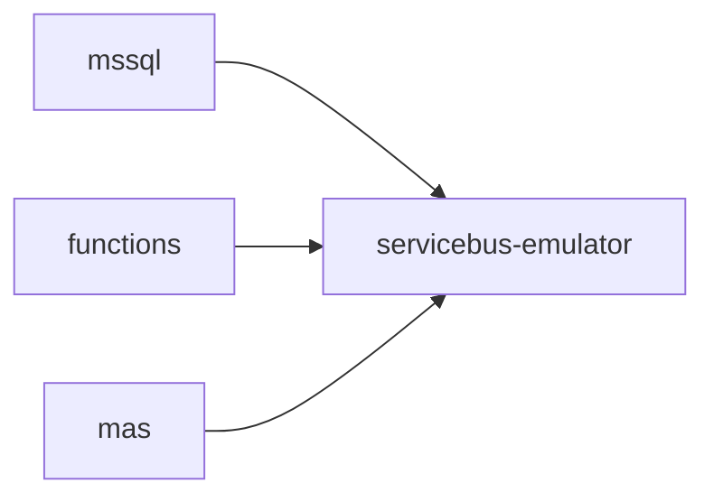

# mssql

`mssql` is an internal dependency for the Service Bus emulator.

## Runtime Contract

- Compose service: `mssql`
- Image: `mcr.microsoft.com/mssql/server:2022-latest`
- Exposed host ports: none
- Main env vars:
  - `ACCEPT_EULA`
  - `MSSQL_SA_PASSWORD`

## Relationship To The Stack

Application services do not use `mssql` directly. They only see it indirectly through `servicebus-emulator`.

## Operational Notes

- The container has no explicit Docker volume in the current Compose file.
- That means its state is transient across container recreation.
- This is acceptable for the local emulator path because queue metadata is bootstrap configuration, not production data.

## Failure Impact

If `mssql` is unavailable:

- `servicebus-emulator` cannot start correctly
- all Service Bus backed orchestration stops with it

The failure is therefore indirect but high impact because it removes queue delivery for:

- realtime HNW jobs
- delayed standard jobs
- generate insight jobs
