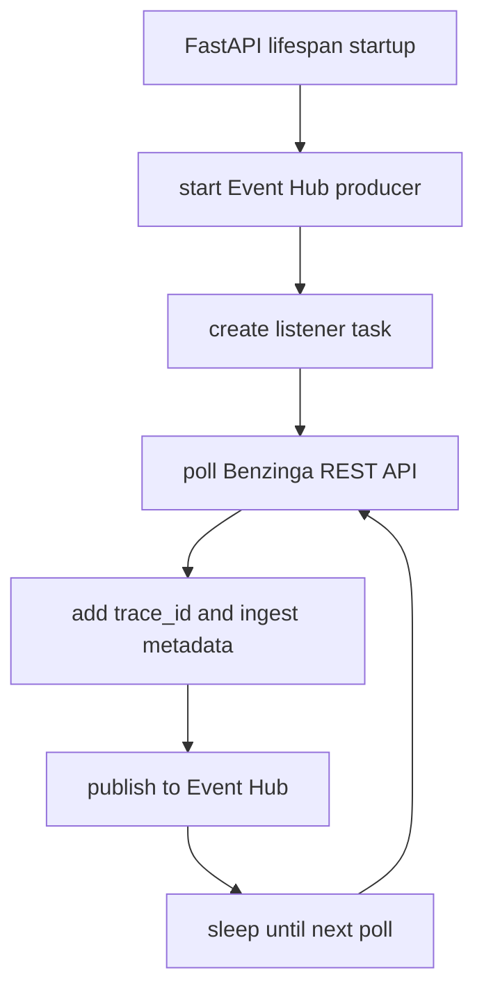

# news_provider

`news_provider` is the ingress service that polls Benzinga and publishes raw events to Event Hub.

## Runtime Contract

- Compose service: `news_provider`
- Build file:
  - [src/app/modules/NEWS_PROVIDER/.dockerfile](../../../src/app/modules/NEWS_PROVIDER/.dockerfile)
- HTTP port:
  - `8080`
- Depends on:
  - `dps_client_processor` completed successfully
- Entrypoint:
  - `uvicorn app.modules.NEWS_PROVIDER.main:app --host 0.0.0.0 --port 8080`

## Logic Flow

## Polling Behavior

The listener in [src/app/modules/NEWS_PROVIDER/listener.py](../../../src/app/modules/NEWS_PROVIDER/listener.py) currently uses:

- poll interval: `60s`
- overlap window: `60s`
- page size: `20`
- timeout: `30s`

That overlap means each run intentionally asks for slightly overlapping updates so recent edits are less likely to be missed.

## Published Payload

Each outbound message contains the source article plus enrichment fields such as:

- `event_type=news_stream`
- `source=benzinga_rest`
- `ingested_at`
- `trace_id`
- `_fetched_at`
- `_poll_updated_since`

## Health Surface

Endpoints exposed by the service:

- `GET /health`
- `GET /ready`
- `GET /stats`

`/ready` is stricter than `/health`. It requires:

- poller task running
- Event Hub producer marked ready
- at least one successful poll completed

## Why It Waits For `dps_client_processor`

The Compose dependency on `dps_client_processor` is deliberate. It avoids ingesting live news before:

- client profiles exist
- holdings snapshots exist
- Elasticsearch has a usable client index

That keeps the downstream MAS path from starting blind.
