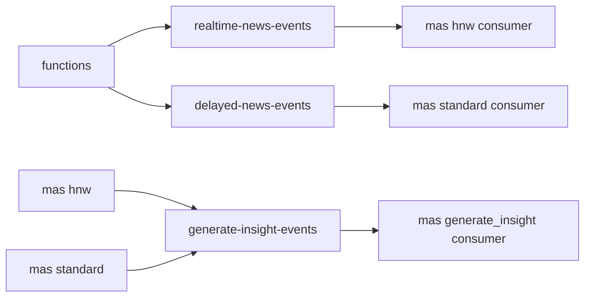

# servicebus-emulator

`servicebus-emulator` is the queue orchestration backbone between Azure Functions and MAS.

## Runtime Contract

- Compose service: `servicebus-emulator`
- Image: `mcr.microsoft.com/azure-messaging/servicebus-emulator:latest`
- Host ports:
  - `127.0.0.2:5672` AMQP
  - `127.0.0.2:5300` management and health API
- Config file:
  - [src/app/common/azure_services/servicebus-config.json](../../../src/app/common/azure_services/servicebus-config.json)
- Hard dependency:
  - `mssql`

## Queue Topology

Configured queues:

- `realtime-news-events`
- `delayed-news-events`
- `generate-insight-events`

## Queue Semantics That Matter

| Queue | Lock Duration | Max Delivery Count | Duplicate Detection |
| --- | --- | --- | --- |
| `realtime-news-events` | `PT1M` | `5` | off |
| `delayed-news-events` | `PT1M` | `5` | off |
| `generate-insight-events` | `PT1M` | `5` | on |

The `generate-insight-events` queue has duplicate detection enabled, which matches MAS using deterministic `job_key` and `message_id` values.

## Business Use

### Functions publishes

- realtime change-feed jobs for newly stored news
- scheduled standard batch jobs for delayed retail processing

### MAS publishes

- per-client `generate_insight` jobs after candidate routing succeeds

### MAS consumes

- all three queues using explicit concurrency controls
- PeekLock mode with completion, abandon, or dead-letter behavior

## Why Service Bus Matters Here

Service Bus adds orchestration features not present in Event Hub:

- scheduled enqueue time for delayed retail processing
- delivery count tracking
- dead-letter behavior after repeated failures
- lock renewal for long-running `generate_insight` jobs

## Failure Impact

If `servicebus-emulator` is unavailable:

- `functions` cannot dispatch HNW or standard workflow jobs
- `mas` cannot consume or publish insight-generation work
- realtime news may exist in Cosmos but never advance into orchestration
