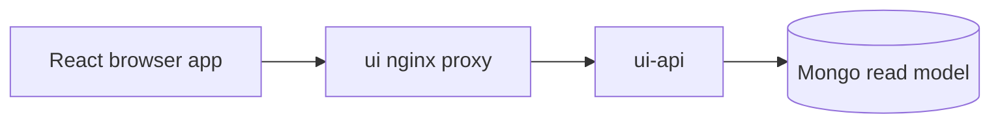

# ui-api

`ui-api` is the FastAPI backend for the React frontend.

## Runtime Contract

- Compose service: `ui-api`
- Build file:
  - [src/app/modules/UI_API/.dockerfile](../../../src/app/modules/UI_API/.dockerfile)
- HTTP port:
  - `8088`
- Depends on:
  - `backup_copy`
- Entrypoint:
  - `uvicorn app.modules.UI_API.main:app --host 0.0.0.0 --port 8088`

## Important Storage Note

`ui-api` is currently Mongo-backed.

It builds a synchronous Mongo client in [src/app/modules/UI_API/main.py](../../../src/app/modules/UI_API/main.py) and does not query Cosmos directly.

## Request Flow

## Endpoint Surface

| Route | Reads |
| --- | --- |
| `GET /api/health` | none |
| `GET /api/clients` | client portfolio collection |
| `GET /api/clients/{client_id}/portfolio` | client portfolio collection |
| `GET /api/clients/{client_id}/insights` | insights collection |
| `GET /api/ops/metrics` | news + insights collections |
| `GET /api/ops/news` | news collection |
| `GET /api/ops/news/{news_id}` | news collection |
| `GET /api/ops/insights` | insights collection |

## What It Adds On Top Of Raw Storage

`ui-api` is not just a pass-through. It:

- deduplicates client directory entries
- shapes portfolio data for UI consumption
- converts monitoring stages into display-friendly labels
- assembles timeline payloads for the ops detail screen
- filters insight documents to the `type=insight` model

## Current Scope Boundary

Pipeline mutation helpers still exist in the codebase, but the routes are commented out in the active FastAPI app. That means the current container is effectively a read API for:

- ops metrics
- recent news
- recent insights
- client directory and portfolio detail

## Failure Impact

If `ui-api` is unavailable:

- the React frontend still serves static HTML, CSS, and JS
- all `/api/*` requests fail
- the app becomes a shell without live data
