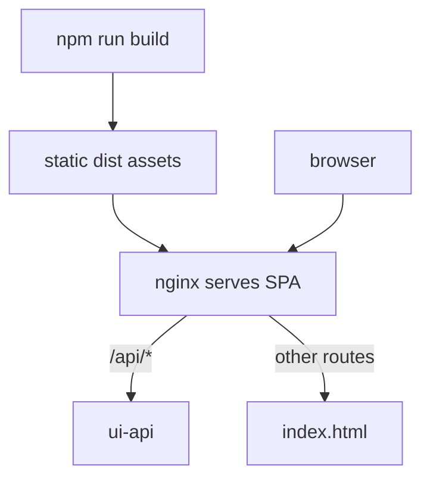

# ui

`ui` is the React frontend container served through nginx.

## Runtime Contract

- Compose service: `ui`
- Build file:
  - [src/ui/Dockerfile](../../../src/ui/Dockerfile)
- Host port:
  - `5173 -> 80`
- Depends on:
  - `ui-api` service started
- Reverse proxy config:
  - [src/ui/nginx.conf](../../../src/ui/nginx.conf)

## Runtime Shape



## Route Map

```mermaid
flowchart LR
    ROOT[/] --> HOME[HomePage]
    ROOT --> OPS[/ops]
    ROOT --> OPSNEWS[/ops/news/:newsId]
    ROOT --> CLIENTS[/clients]
    ROOT --> CLIENT[/clients/:clientId]
```

Primary screens:

- home overview
- ops center
- client workspace

## UI Logic Boundaries

The frontend is intentionally thin:

- routing in [src/ui/src/App.tsx](../../../src/ui/src/App.tsx)
- layout shell in [src/ui/src/components/AppFrame.tsx](../../../src/ui/src/components/AppFrame.tsx)
- data access through [src/ui/src/lib/api.ts](../../../src/ui/src/lib/api.ts)

Business logic stays server-side in `ui-api`, `functions`, and `mas`.

## What Each Main Page Does

### Home

- health check
- top-line ops metrics
- client count
- recent insight preview

### Ops Center

- recent news list
- news detail pane
- monitoring timeline
- recent insights preview

### Client Workspace

- searchable client directory
- selected client portfolio summary
- classification and asset-type weights
- client-specific insight history

## Failure Impact

If `ui` is unavailable:

- the backend API can still respond
- operators lose the browser surface for inspecting the system

If `ui-api` is unavailable while `ui` is healthy:

- navigation still renders
- data-driven panels fail through the API client error path
