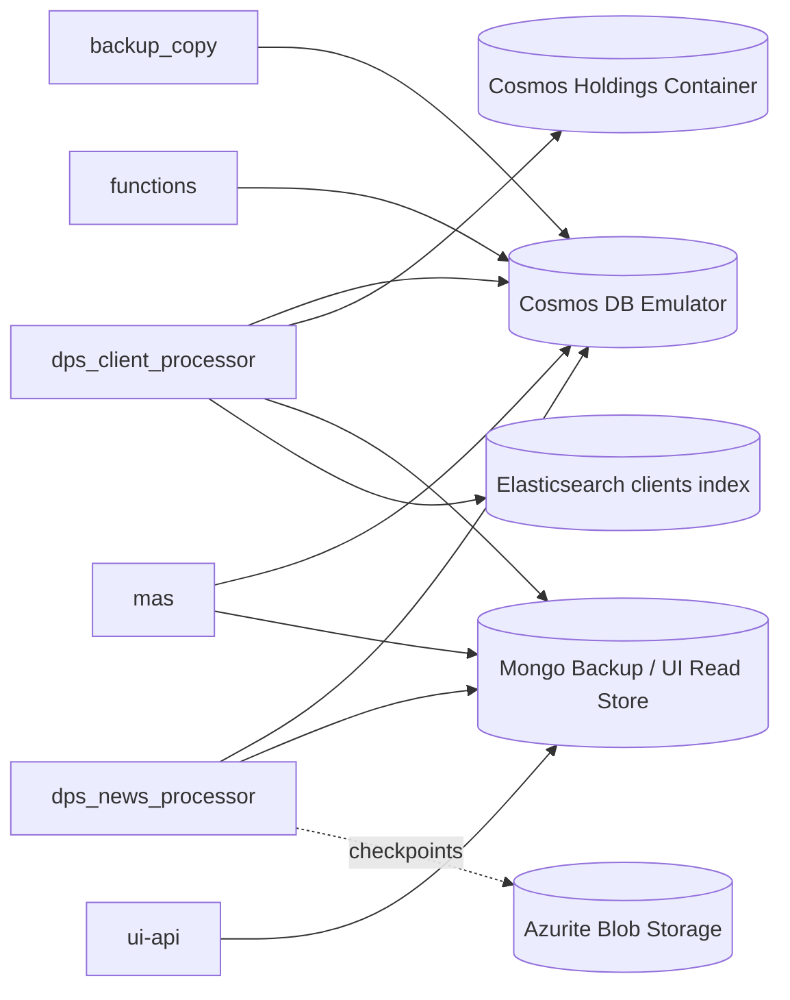

# Storage And Contracts

This document captures the shared data rules that sit underneath multiple services.

## Storage Ownership

## Primary Stores

| Store | Main Contents | Written By | Read By |
| --- | --- | --- | --- |
| Cosmos news container | normalized news docs plus monitoring timeline | `dps_news_processor`, `mas`, `functions` monitoring updates | `functions`, `mas` |
| Cosmos client portfolio container | client search profiles | `dps_client_processor`, `backup_copy` restore | `mas` |
| Cosmos client holdings container | canonical holdings snapshots | `dps_client_processor` | `mas` grounding logic |
| Cosmos insights container | generated insight records | `mas`, `backup_copy` restore | operationally secondary in current UI path |
| Mongo collections | mirrored backup/read model for news, client profiles, insights | `dps_client_processor`, `dps_news_processor`, `mas` when backup enabled | `ui-api`, `backup_copy` |
| Elasticsearch `clients` index | dense + lexical retrieval corpus for client relevance | `dps_client_processor` | `mas` |
| Azurite blob container | Event Hub checkpoints | `dps_news_processor` | `dps_news_processor` |

## Event Contracts

### Event Hub

- producer: `news_provider`
- consumer: `dps_news_processor`
- payload shape: raw Benzinga document plus enrichment fields such as `event_type`, `source`, `ingested_at`, `trace_id`, `_fetched_at`, and `_poll_updated_since`

### Service Bus Queues

| Queue | Producer | Consumer | Business Meaning |
| --- | --- | --- | --- |
| `realtime-news-events` | `functions.change_feed_service` | `mas` `hnw` workflow | immediate processing of newly stored news documents |
| `delayed-news-events` | `functions.standard_trigger` | `mas` `standard` workflow | scheduled retail batch processing window |
| `generate-insight-events` | `mas` standard and HNW workflows | `mas` `generate_insight` workflow | per-client insight generation job |

## Monitoring Contract On News Documents

News documents are progressively annotated with a `monitoring` block. The main fields are:

- `current_stage`
- `current_status`
- `updated_at`
- `first_seen_at`
- `stages.<stage_name>`
- `timeline[]`

Typical stages recorded in the current path:

- `dps_news_processor`
- `retail_batch`
- `change_feed_to_mas`
- `mas_hnw`
- `mas_standard`
- `generate_insight_queue`
- `generate_insight`

## Key Data Shape Rules

### Client profile document

- lives in the configured `CLIENT_PORTFOLIO_CONTAINER`
- represents the retrieval/search profile used by `mas`
- includes `client_segment`, `mandate`, `asset_classifications`, `major_tickers`, `currencies`, `compact_summary_text`, and weight maps

### Holdings snapshot document

- lives in `<CLIENT_PORTFOLIO_CONTAINER>_holdings`
- stores canonicalized holdings for grounding and route assignment
- uses `client_id` as the partition key and `portfolio_holdings:<snapshot_id>` as the document id

### Insight document

- id format: `insight:<client_id>:<news_doc_id>`
- includes `execution_route`, `route_reason`, `grounded_relevance`, `matched_holdings`, `verification_score`, `token_usage`, and final `status`

## Operational Consequences

- If Mongo mirroring is disabled, `ui-api` loses its live read model because it does not currently read Cosmos directly.
- `backup_copy` restores only the main containers defined in its settings: news, client portfolios, and insights. Holdings snapshots are rebuilt by `dps_client_processor`.
- `generate-insight-events` enables duplicate detection in the Service Bus emulator config, which aligns with `mas` using deterministic `message_id` and `job_key` values.
