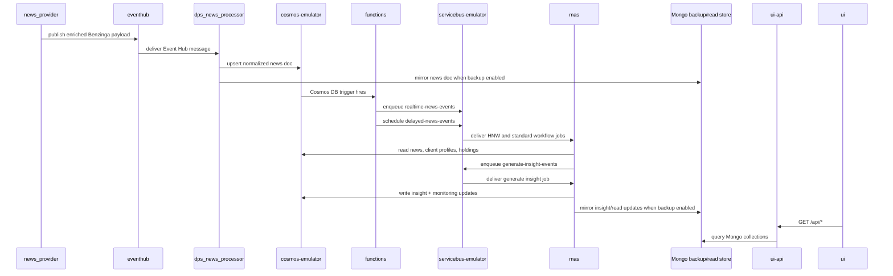
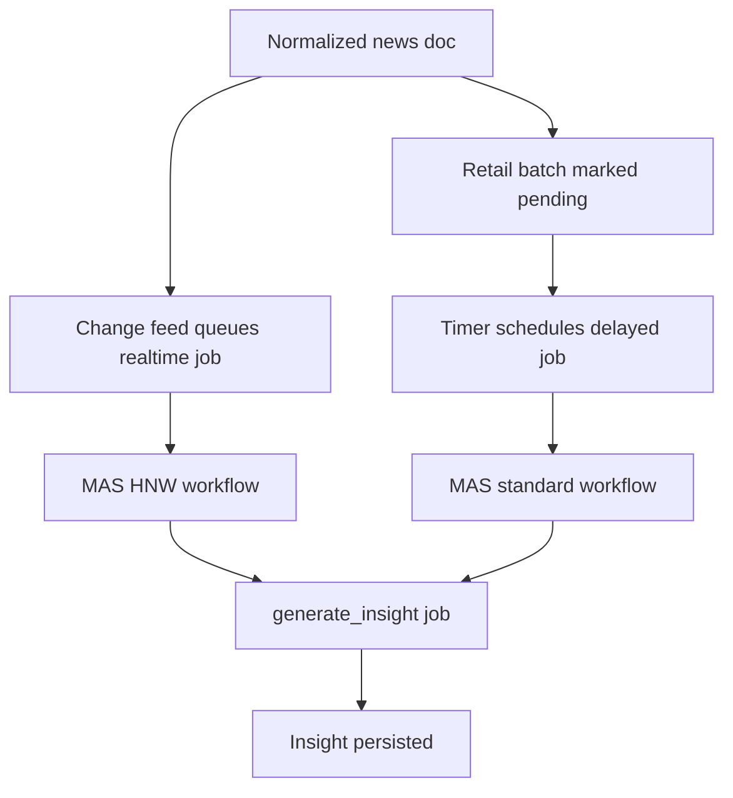

# News To Insight Workflow

This is the main end-to-end business path in the current Docker runtime.

## Sequence

## Phase Breakdown

### 1. Ingestion

- `news_provider` polls Benzinga once per minute.
- It keeps a rolling `updatedSince` cursor with a one-minute overlap to reduce missed updates.
- Each raw article is enriched with ingestion metadata before being sent to Event Hub.

### 2. Normalization And Persistence

- `dps_news_processor` consumes the Event Hub stream using consumer group `DPS`.
- It normalizes article fields into a stable document shape.
- It stamps the document with:
  - `dps_news_processor=stored`
  - `retail_batch=pending`
- It upserts the result into Cosmos and checkpoints the Event Hub message.

### 3. Queue Dispatch

- `functions.change_feed_service` reacts to new Cosmos documents and publishes `realtime_news` messages to `realtime-news-events`.
- It skips documents already marked with `monitoring.stages.change_feed_to_mas`.
- `functions.standard_trigger` periodically schedules `standard_news` messages onto `delayed-news-events`.

### 4. Workflow Routing In MAS

- realtime queue -> `hnw` workflow
- delayed queue -> `standard` workflow
- generate insight queue -> `generate_insight` workflow

Both HNW and standard workflows:

- retrieve candidate clients through Elasticsearch-backed relevance search
- ground those candidates against holdings snapshots in Cosmos
- assign an execution route:
  - `full_loop`
  - `single_pass_indirect`
  - `skip`
- publish per-client insight jobs when the candidate survives routing

### 5. Insight Generation

- `generate_insight` builds a compact portfolio context.
- It generates an insight draft with the LLM backend.
- Full-loop jobs pass through precheck plus verifier scoring.
- Single-pass indirect jobs skip verifier and persist immediately.
- Final results are written into the insights container and optionally mirrored to Mongo.

## Route Split

## What The UI Sees

- The React UI does not call Cosmos directly.
- `ui-api` exposes read-only endpoints over Mongo-backed collections.
- Ops pages show monitoring stage history derived from the mirrored news documents.
- Client pages show client profiles and saved insights from the mirrored collections.
