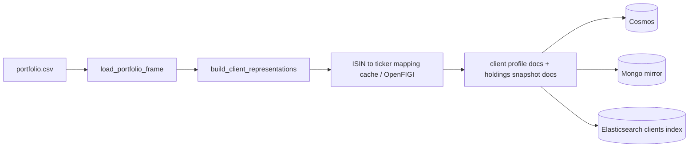
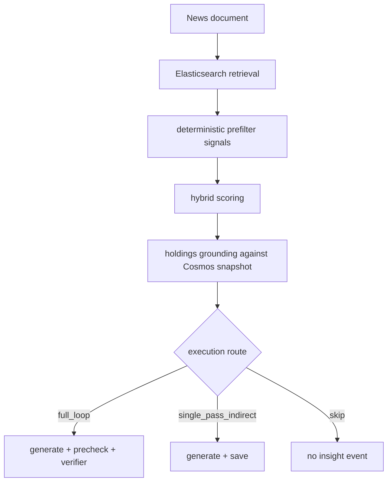

# Portfolio And Relevance Workflow

This workflow spans the one-shot portfolio loader and the MAS relevance stack.

## Portfolio Build Path

## Client Representation Logic

`dps_client_processor` transforms the CSV into two persistence models:

- search relevance profile
- canonical holdings snapshot

The processing stages are:

1. load the source CSV
2. group rows into per-client portfolios
3. compute segment and mandate context
4. normalize holdings metadata
5. resolve ISIN to ticker using cache first, then OpenFIGI for misses
6. write portfolio and holdings documents to Cosmos
7. mirror writes to Mongo when enabled
8. index client profile documents into Elasticsearch with dense embeddings

## MAS Relevance Path

## What Drives Candidate Selection

The MAS search layer combines:

- ticker overlap
- tag overlap
- classification overlap
- mandate/topic fit
- lexical retrieval over profile text
- embedding retrieval over the Elasticsearch `clients` index

The holding matcher then converts a search candidate into grounded exposure using:

- direct ISIN match
- direct ticker match
- direct underlying ticker match
- direct issuer match
- indirect currency overlap
- indirect macro-allocation classification overlap

## Execution Route Rules

| Route | Trigger |
| --- | --- |
| `full_loop` | direct grounded exposure or direct symbol overlap |
| `single_pass_indirect` | indirect exposure survives thresholds but has no direct holding match |
| `skip` | no actionable grounding, insufficient matched holdings, low top match score, or security-type mismatch |

## Current Threshold Families

- Standard workflow defaults:
  - `RELEVANCE_MIN_SCORE=0.75`
  - `RELEVANCE_FINAL_TOP_N=10`
- HNW workflow defaults:
  - `HNW_RELEVANCE_MIN_SCORE=0.85`
  - `HNW_RELEVANCE_FINAL_TOP_N=5`
- Generate insight verifier loop:
  - pass threshold `75`
  - max iterations `3`

## Why `dps_client_processor` Gates `news_provider`

The Compose dependency chain makes `news_provider` wait for `dps_client_processor` to complete successfully. That prevents the system from ingesting live news before:

- client profiles exist in Cosmos
- holdings snapshots exist in Cosmos
- the Elasticsearch client retrieval index is populated

Without that preload step, MAS would have little or no client context to score against.
